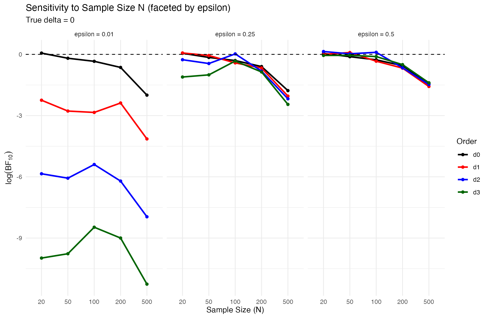
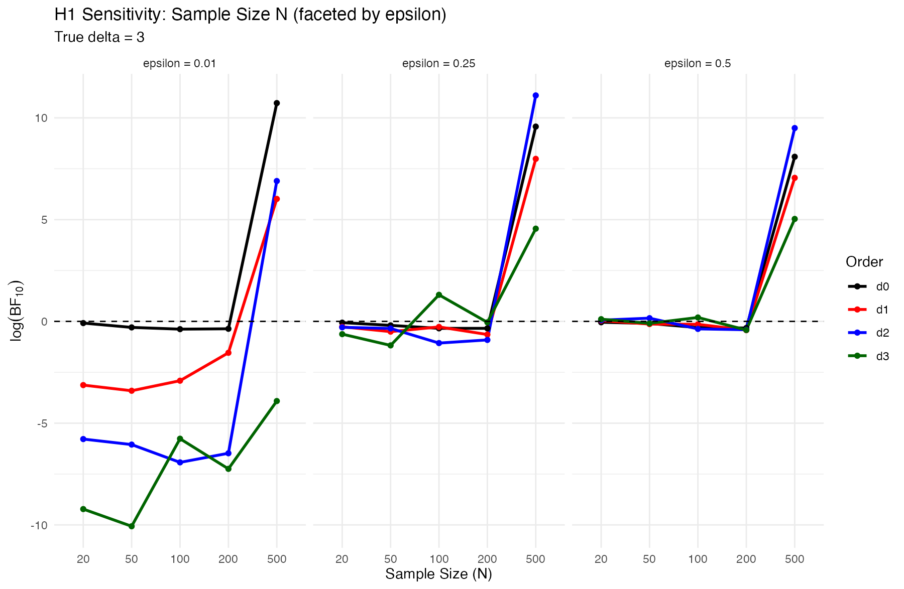

📄 Johnson, V. E., & Rossell, D. (2010). On the Use of Non-Local Prior Densities in Bayesian Hypothesis Tests. Journal of the Royal Statistical Society. Series B (Statistical Methodology), 72(2), 143–170. http://www.jstor.org/stable/40541581

```{r}
# ============================================================
# Moment-prior family for delta >= 0 with matched median = 2
# Base: half-t(df=6, scale=2.79)  (as you decided)
# Orders: d = 0,1,2,3
# Output:
#   - kappa values (median-matching)
#   - quantile table (q50/q90/q99)
#   - one plot with 4 prior curves
# ============================================================

# ---- settings
df0 <- 6
s0 <- 2.79
m_target <- 2
orders <- 0:3
probs <- c(0.5, 0.9, 0.99)

# ---- base half-t+ pdf: g(x), x>=0
g_base <- function(x, df = df0, s = s0) {
  2 * dt(x / s, df = df) / s
}

# ---- normalizing constant C_d for kappa = 1
C_d_half_t <- function(d, df = df0, s = s0) {
  if (d >= df) {
    stop("Need d < df for the moment to exist (choose df > max d).")
  }
  s^d * (df^(d / 2)) * gamma((d + 1) / 2) * gamma((df - d) / 2) / (sqrt(pi) * gamma(df / 2))
}

# ---- scaled base: g_k(x) = (1/k) g(x/k)
g_scaled <- function(x, kappa, df = df0, s = s0) {
  (1 / kappa) * g_base(x / kappa, df = df, s = s0)
}

# ---- moment prior pdf with scaled base
# pi_{d,k}(x) = x^d g_k(x) / C_d(k),  where C_d(k) = k^d * C_d(1)
prior_moment <- function(x, d, kappa, df = df0, s = s0) {
  if (any(x < 0)) {
    stop("x must be >= 0")
  }
  if (d == 0) {
    return(g_scaled(x, kappa = kappa, df = df, s = s))
  }
  Ck <- (kappa^d) * C_d_half_t(d, df = df, s = s)
  x^d * g_scaled(x, kappa = kappa, df = df, s = s) / Ck
}

# ---- numeric quantile for a given prior pdf
prior_quantile <- function(pdf_fun, p, upper_start = NULL, rel.tol = 1e-8) {
  cdf <- function(q) {
    if (q <= 0) {
      return(0)
    }
    integrate(pdf_fun, lower = 0, upper = q, rel.tol = rel.tol)$value
  }
  upper <- if (is.null(upper_start)) 1 else upper_start
  while (cdf(upper) < p) {
    upper <- upper * 2
  }
  uniroot(function(q) cdf(q) - p, lower = 0, upper = upper, tol = 1e-8)$root
}

# ---- compute kappa_d so median is m_target
# scaling property: median(d,kappa) = kappa * median(d,1)
# so kappa = m_target / median(d,1)
compute_kappa <- function(d) {
  pdf_k1 <- function(x) prior_moment(x, d = d, kappa = 1)
  med1 <- prior_quantile(pdf_k1, p = 0.5, upper_start = s0)
  m_target / med1
}

# ---- kappa values
kappa <- setNames(vapply(orders, compute_kappa, numeric(1)), paste0("d", orders))

# ---- quantile table
quantile_table <- do.call(
  rbind,
  lapply(orders, function(d) {
    pdf <- function(x) prior_moment(x, d = d, kappa = kappa[paste0("d", d)])
    qs <- vapply(probs, function(p) prior_quantile(pdf, p = p, upper_start = s0), numeric(1))
    data.frame(order = paste0("d", d), q50 = qs[1], q90 = qs[2], q99 = qs[3], row.names = NULL)
  })
)
quantile_table$kappa <- unname(kappa[quantile_table$order])
```

## 1. Moment prior

In Johnson & Rossell’s definition of a moment prior, the prior density is proportional to a polynomial term that vanishes at the null value, multiplied by a base prior density. For a scalar parameter $\theta$ with null value $\theta_0$, the moment prior of order $k$ is defined as:

$$
\pi_M(\theta)=\frac{(\theta-\theta_0)^{2k}}{\tau_k}\,\pi_b(\theta)
$$

The moment prior on $\delta$: $$
 \pi_d(\delta) = \frac{(\delta/\kappa_d)^d}{C_d} g(\delta),
$$

where $$
C_d = \int_0^\infty \delta^d g(\delta)\, d\delta = \mathbb{E}_g[\delta^d],
$$

-   The base prior below which makes sure the median is 2, the base prior must have the relevant finite moments, and the moment across different orders $d$ is finite. $$
      g(\delta) = t^+_{6}(0, 2.79)
      $$

-   Choose $\kappa_d$ to match median = 2. This keeps tails comparable while still forcing $\pi_d(0)=0$ for $d\ge1$.

```{r}
knitr::kable(
  dplyr::mutate(
    quantile_table,
    dplyr::across(where(is.numeric), ~ round(.x, 3))
  ),
  caption = "Quantiles of the moment priors with median-matching kappa"
)
```

```{r}
cols <- c("black", "red", "blue", "darkgreen")
x_max <- max(quantile_table$q99) * 1.2

f0 <- Vectorize(function(x) prior_moment(x, d = 0, kappa = unname(kappa["d0"]), df = df0, s = s0))
f1 <- Vectorize(function(x) prior_moment(x, d = 1, kappa = unname(kappa["d1"]), df = df0, s = s0))
f2 <- Vectorize(function(x) prior_moment(x, d = 2, kappa = unname(kappa["d2"]), df = df0, s = s0))
f3 <- Vectorize(function(x) prior_moment(x, d = 3, kappa = unname(kappa["d3"]), df = df0, s = s0))

curve(
  f0,
  from = 0,
  to = x_max,
  n = 2000,
  col = cols[1],
  lwd = 2,
  xlim = c(0, x_max),
  ylim = c(0, 0.42),
  xlab = expression(delta),
  ylab = "density",
  main = "Moment priors on delta"
)
curve(f1, from = 0, to = x_max, n = 2000, add = TRUE, col = cols[2], lwd = 2)
curve(f2, from = 0, to = x_max, n = 2000, add = TRUE, col = cols[3], lwd = 2)
curve(f3, from = 0, to = x_max, n = 2000, add = TRUE, col = cols[4], lwd = 2)

legend("topright", legend = c("d0 (base)", "d1", "d2", "d3"), col = cols, lwd = 2, lty = 1)
```

## compute interval-null BF10 for delta

Testing problem: $$
H_0: \delta = 0 \quad \text{vs} \quad H_1: \delta > 0
$$

Interval-null BF10: $$
\text{BF10} = \frac{P(\delta < \epsilon \mid H_1)}{P(\delta < \epsilon \mid H_0)}, \quad \epsilon > 0.
$$

$$
\text{BF10} = \frac{\pi_d(\delta < \epsilon)}{\pi_d(\delta < \epsilon \mid y)}, \quad \epsilon > 0.
$$

[How to go from formula 1 to 2??]{style="color: red;"}

```{stan}
real s_eff = s_delta * kappa_delta;

for (j in 1:P) {
  // base half-t+ on delta with scale s_eff
  lprior += student_t_lpdf(delta[j] | df_delta, 0, s_eff) - student_t_lccdf(0 | df_delta, 0, s_eff);

  // multiply by delta^d  => add d*log(delta)
  if (d_order > 0)
    lprior += d_order * log(delta[j]);

  // subtract normalization: logC_base + d*log(kappa_delta)
  // Requirement: logC_base is computed for this d_order under base scale s_delta (kappa=1)
  // For d_order=0, set logC_base=0 and typically kappa_delta=1.
  lprior -= (logC_base + d_order * log(kappa_delta));
}

```

```{tex}
# Build Stan input data for a given moment-prior order d_order
# Requires objects already defined in your script:
#   df0, s0, kappa, C_d_half_t()

make_stan_data <- function(X, y, d_order) {
  X <- as.matrix(X)
  y <- as.vector(y)
  stopifnot(nrow(X) == length(y))

  if (!(paste0("d", d_order) %in% names(kappa))) {
    stop("kappa does not contain this d_order. Recompute kappa first.")
  }

  list(
    N = nrow(X),
    P = ncol(X),
    X = X,
    y = y,
    d_order = as.integer(d_order),
    kappa_delta = as.numeric(kappa[paste0("d", d_order)]),
    df_delta = as.integer(df0),
    s_delta = as.numeric(s0),
    logC_base = if (d_order == 0) 0 else log(C_d_half_t(d_order, df = df0, s = s0))
  )
}


```

```{r}
# ============================================================
# Part 1: Simulate Data with Known GP Effect
# ============================================================
set.seed(123)
N <- 50
X <- seq(-0.5, 0.5, length = N) |> matrix(ncol = 1)

# Generate data with
# (1) true delta = 3 (nonlinear effect exists)
# (2) true delta = 0.1 (no nonlinear effect)
y <- generate_gp_data(
  delta = 3,
  lambda = 0.3,
  sigma = 0.1,
  N = 50,
  x = X,
  n_samples = 1
) |>
  as.vector()

data_d0 <- make_stan_data(X, y, 0)
data_d1 <- make_stan_data(X, y, 1)
data_d2 <- make_stan_data(X, y, 2)
data_d3 <- make_stan_data(X, y, 3)

fit_gp_p1 <- rstan::sampling(
  gp_add_16,
  data = data_d0,
  iter = 5000,
  warmup = 500,
  chains = 2,
  seed = 123,
  refresh = 1000,
  verbose = FALSE,
  open_progress = FALSE
)

fit_gp_p2 <- rstan::sampling(
  gp_add_16,
  data = data_d1,
  iter = 5000,
  warmup = 500,
  chains = 2,
  seed = 123,
  refresh = 1000,
  verbose = FALSE,
  open_progress = FALSE
)

fit_gp_p3 <- rstan::sampling(
  gp_add_16,
  data = data_d2,
  iter = 5000,
  warmup = 500,
  chains = 2,
  seed = 123,
  refresh = 1000,
  verbose = FALSE,
  open_progress = FALSE
)

fit_gp_p4 <- rstan::sampling(
  gp_add_16,
  data = data_d3,
  iter = 5000,
  warmup = 500,
  chains = 2,
  seed = 123,
  refresh = 1000,
  verbose = FALSE,
  open_progress = FALSE
)


```

```{r}
fit_null <- rstan::sampling(
  gp_null,
  data = data_d3,
  iter = 5000,
  warmup = 500,
  chains = 2,
  seed = 123,
  refresh = 1000,
  verbose = FALSE,
  open_progress = FALSE
)

bridge0 <- bridgesampling::bridge_sampler(fit_null)

bridgesampling::bf(bridgesampling::bridge_sampler(fit_gp_p1), bridge0, log = TRUE)$bf
bridgesampling::bf(bridgesampling::bridge_sampler(fit_gp_p2), bridge0, log = TRUE)$bf
bridgesampling::bf(bridgesampling::bridge_sampler(fit_gp_p3), bridge0, log = TRUE)$bf
bridgesampling::bf(bridgesampling::bridge_sampler(fit_gp_p4), bridge0, log = TRUE)$bf
```

```{r}
# ============================================================
# Interval-null BF10 for delta under the moment-prior family
# - No point density at 0. Only interval probability P(delta < eps)
# - Posterior probability: estimate via logspline CDF (plogspline)
# - Prior probability: computed by integrating prior_moment()
# - Uses sd(delta_draws)/d for the "sd/d" eps rule (optional)
# Requires from the current script:
#   prior_moment(), df0, s0, kappa   (kappa has names d0,d1,d2,d3)
# ============================================================

# ---- Posterior interval probability via logspline with tail trimming
post_prob_delta_lt_epsilon_logspline <- function(x, eps, max_attempts = 5) {
  stopifnot(is.numeric(x), length(x) > 10, is.finite(eps), eps >= 0)
  x <- x[is.finite(x) & x >= 0]

  quantiles <- c(1, 0.999, 0.99, 0.9, 0.8)

  for (q in quantiles[1:max_attempts]) {
    cutoff <- as.numeric(stats::quantile(x, q, names = FALSE, type = 5))
    keep <- x <= cutoff
    x_trim <- x[keep]

    fit <- try(logspline::logspline(x_trim, lbound = 0, ubound = max(x_trim)), silent = TRUE)
    if (!inherits(fit, "try-error")) {
      # CDF under trimmed distribution, then renormalize
      p_keep <- mean(keep)
      p_trim <- logspline::plogspline(eps, fit)
      return(p_keep * p_trim)
    }
  }

  warning("logspline failed for all tail-cuts. Returning NA.")
  NA_real_
}

# ---- Prior interval probability by numerical integration of prior_moment()
prior_prob_delta_lt_epsilon_moment <- function(d_order, eps, rel.tol = 1e-8) {
  stopifnot(is.finite(eps), eps >= 0)
  key <- paste0("d", d_order)
  if (!key %in% names(kappa)) {
    stop("kappa does not contain this d_order.")
  }

  if (eps == 0) {
    return(0)
  }

  pdf <- function(z) prior_moment(z, d = d_order, kappa = unname(kappa[key]), df = df0, s = s0)
  integrate(pdf, lower = 0, upper = eps, rel.tol = rel.tol)$value
}

# ---- Vectorized wrappers (eps grid + sd/d rule)
prior_prob_vec <- function(d_order, eps = NULL, d = NULL, sd_x = NULL) {
  if (is.null(eps) && (is.null(d) || all(d == 0))) {
    eps <- 0
  }

  eps_vals <- c(
    if (is.null(eps)) numeric(0) else eps,
    if (is.null(d) || all(d == 0)) numeric(0) else sd_x / d
  )

  vapply(eps_vals, function(eps_i) prior_prob_delta_lt_epsilon_moment(d_order, eps_i), numeric(1))
}

post_prob_vec <- function(x, eps = NULL, d = NULL, sd_x = NULL, max_attempts = 5) {
  if (is.null(eps) && (is.null(d) || all(d == 0))) {
    eps <- 0
  }

  eps_vals <- c(
    if (is.null(eps)) numeric(0) else eps,
    if (is.null(d) || all(d == 0)) numeric(0) else sd_x / d
  )

  vapply(eps_vals, function(eps_i) post_prob_delta_lt_epsilon_logspline(x, eps_i, max_attempts), numeric(1))
}

# ---- Main: interval-null BF10 = prior0 / post0 (your definition)
bf10_interval_null_delta_moment <- function(
  delta_draws,
  d_order, # 0,1,2,3
  eps = NULL, # numeric vector of epsilons
  d = NULL, # numeric vector: for sd/d rule
  return_log = TRUE,
  max_attempts = 5
) {
  delta_draws <- as.numeric(delta_draws)
  delta_draws <- delta_draws[is.finite(delta_draws) & delta_draws >= 0]

  sd_x <- stats::sd(delta_draws)

  prior0 <- prior_prob_vec(d_order, eps = eps, d = d, sd_x = sd_x)
  post0 <- post_prob_vec(delta_draws, eps = eps, d = d, sd_x = sd_x, max_attempts = max_attempts)

  if (is.null(eps) && (is.null(d) || all(d == 0))) {
    eps <- 0
  }
  eps_vals <- c(
    if (is.null(eps)) numeric(0) else eps,
    if (is.null(d) || all(d == 0)) numeric(0) else sd_x / d
  )
  tag <- c(
    if (is.null(eps)) character(0) else paste0("eps=", eps),
    if (is.null(d) || all(d == 0)) character(0) else paste0("sd/", d)
  )

  bf10 <- prior0 / post0
  if (return_log) {
    bf10 <- log(bf10)
  }

  out <- data.frame(
    epsilon = eps_vals,
    prior0 = prior0,
    post0 = post0,
    tag = tag,
    stringsAsFactors = FALSE
  )

  if (return_log) {
    out$log_bf10 <- bf10
  } else {
    out$bf10 <- bf10
  }
  out
}
```

```{r}
# Compute interval-null BF tables for four rstan fits (d=0,1,2,3)
# Uses: rstan::extract(fit)$delta

get_delta_draws_rstan <- function(fit) {
  delta <- rstan::extract(fit)$delta
  as.numeric(delta) # flatten iterations x P
}

run_bf_for_4fits_rstan <- function(fits, orders = 0:3, eps = c(0.1, 0.3, 0.5, 0.7), d_sd = c(2, 4, 6)) {
  stopifnot(length(fits) == length(orders))

  do.call(
    rbind,
    lapply(seq_along(fits), function(i) {
      delta_draws <- get_delta_draws_rstan(fits[[i]])
      tbl <- bf10_interval_null_delta_moment(
        delta_draws = delta_draws,
        d_order = orders[i],
        eps = eps,
        d = d_sd,
        return_log = TRUE
      )
      tbl$order <- paste0("d", orders[i])
      tbl[, c("order", "epsilon", "tag", "prior0", "post0", "log_bf10")]
    })
  )
}

fits <- list(fit_gp_p1, fit_gp_p2, fit_gp_p3, fit_gp_p4) # must correspond to d=0..3
bf_table <- run_bf_for_4fits_rstan(fits, orders = 0:3)
bf_table
```

```{r}
# Compute logBF10 curves on an epsilon grid using bf10_interval_null_delta_moment()
# (which uses logspline for post0), then plot one line per d.

get_delta_draws <- function(fit) as.numeric(rstan::extract(fit)$delta)

plot_logbf10_grid_logspline <- function(
  fits, # list of 4 rstan fits in order d=0,1,2,3
  orders = 0:3,
  eps_grid = seq(0.01, 1, by = 0.01),
  cols = c("black", "red", "blue", "darkgreen")
) {
  stopifnot(length(fits) == length(orders))

  logbf_mat <- matrix(NA_real_, nrow = length(eps_grid), ncol = length(orders))
  colnames(logbf_mat) <- paste0("d", orders)

  for (i in seq_along(orders)) {
    d <- orders[i]
    delta_draws <- get_delta_draws(fits[[i]])

    # Use YOUR logspline-based BF function at each grid point
    tab <- bf10_interval_null_delta_moment(
      delta_draws = delta_draws,
      d_order = d,
      eps = eps_grid,
      d = NULL, # no sd-based eps here
      return_log = TRUE
    )

    # Ensure order matches eps_grid
    tab <- tab[match(eps_grid, tab$epsilon), ]
    logbf_mat[, i] <- tab$log_bf10
  }

  matplot(
    eps_grid,
    logbf_mat,
    type = "l",
    lty = 1,
    lwd = 2,
    col = cols,
    xlab = expression(epsilon),
    ylab = expression(log(BF[10]))
  )
  abline(h = 0, lty = 2)
  legend("bottomright", legend = colnames(logbf_mat), col = cols, lty = 1, lwd = 2)

  invisible(list(eps = eps_grid, logbf = logbf_mat))
}

fits <- list(fit_gp_p1, fit_gp_p2, fit_gp_p3, fit_gp_p4)
res <- plot_logbf10_grid_logspline(fits, orders = 0:3, eps_grid = seq(0.01, 1, by = 0.01))
```

If you want a diagnostic that matches the theory statement more closely, restrict the x-axis to the region where the priors actually differ (e.g. $\epsilon \in [0, 0.2]$):

```{tex}
plot_logbf10_grid_logspline(fits, orders = 0:3, eps_grid = seq(0.005, 0.4, by = 0.002))
```

```{r}
post0_emp = vapply(eps_grid, function(i) mean(delta_draws < i), numeric(1))
post0_logspline = post_prob_vec(delta_draws, eps = eps_grid)
plot(eps_grid, post0_emp, type = "l", col = "blue", lwd = 2, xlab = expression(epsilon), ylab = "estimated post0")
lines(eps_grid, post0_logspline, col = "red", lwd = 2)
legend("topleft", legend = c("Empirical CDF", "Logspline CDF"), col = c("blue", "red"), lwd = 2, lty = 1)
```

```{r}
prior0 = prior_prob_vec(d_order = 3, eps = eps_grid)
bf10_emp = prior0 / post0_emp
bf10_logspline = prior0 / post0_logspline
plot(
  eps_grid,
  log(bf10_emp),
  type = "l",
  col = "blue",
  lwd = 2,
  ylim = c(-5, 8),
  xlab = expression(epsilon),
  ylab = expression(log(BF[10]))
)
lines(eps_grid, log(bf10_logspline), col = "red", lwd = 2)
legend("bottomright", legend = c("Empirical CDF", "Logspline CDF"), col = c("blue", "red"), lwd = 2, lty = 1)
```

```{r}
delta_draws_list <- lapply(fits, get_delta_draws)
names(delta_draws_list) <- paste0("d", orders)

boxplot(
  delta_draws_list,
  main = "Posterior draws of delta by moment order",
  ylab = expression(delta),
  xlab = "order",
  ylim = c(0, 5)
)
```

## 2. Sensitivity Analysis: Sample Size $N$ and $\epsilon$

This experiment investigates how the Interval-null Bayes Factor $BF_{10}$ behaves as we increase the sample size $N$, across a grid of $\epsilon$ values. We use a single master dataset with true $\delta = 3$.

```{r}
#| label: n-sensitivity-experiment
#| message: false
#| warning: false

# 1. Generate a large master dataset (N=500)
set.seed(42)
N_max <- 500
X_max <- seq(-0.5, 0.5, length = N_max) |> matrix(ncol = 1)
y_max <- generate_gp_data(
  delta = 0.01, # True effect exists
  lambda = 0.3,
  sigma = 0.1,
  N = N_max,
  x = X_max,
  n_samples = 1
) |>
  as.vector()

# 2. Settings for the experiment
N_grid <- c(20, 50, 100, 200, 500)
eps_grid_fine <- seq(0.01, 1, length.out = 100)
orders_grid <- 0:3

results_N_eps <- list()

for (n_sub in N_grid) {
  X_sub <- X_max[1:n_sub, , drop = FALSE]
  y_sub <- y_max[1:n_sub]

  for (d_val in orders_grid) {
    # Prepare Stan data
    data_sub <- make_stan_data(X_sub, y_sub, d_order = d_val)

    # Fit model
    fit_sub <- rstan::sampling(
      gp_add_16,
      data = data_sub,
      iter = 2000,
      warmup = 500,
      chains = 2,
      seed = 123,
      refresh = 1000,
      verbose = FALSE,
      open_progress = FALSE
    )

    # Extract draws
    draws_sub <- get_delta_draws_rstan(fit_sub)

    # Compute BF across the epsilon grid
    bf_res <- bf10_interval_null_delta_moment(
      delta_draws = draws_sub,
      d_order = d_val,
      eps = eps_grid_fine,
      return_log = TRUE
    )

    bf_res$N <- n_sub
    bf_res$order <- paste0("d", d_val)
    results_N_eps[[paste(n_sub, d_val, sep = "_")]] <- bf_res
  }
}

# Combine results
df_N_eps <- do.call(rbind, results_N_eps)
```

### Visualizing the $N$-consistency

```{r}
#| label: plot-n-sensitivity
#| fig-width: 10
#| fig-height: 8
library(ggplot2)

# Plot 1: Facet by Moment Order (d), Color by N
ggplot(df_N_eps, aes(x = epsilon, y = log_bf10, color = as.factor(N), group = N)) +
  geom_line(linewidth = 1) +
  geom_hline(yintercept = 0, linetype = "dashed") +
  facet_wrap(~order, scales = "free_y") +
  labs(
    title = "Sensitivity to sample size N (faceted by order d)",
    subtitle = "True delta = 0",
    x = expression(epsilon),
    y = expression(log(BF[10])),
    color = "N"
  ) +
  theme_minimal()
```

```{r}
#| fig-width: 15
#| fig-height: 8

# Plot 2: N on x-axis, color by Order (d), faceted by selected epsilon values
eps_targets <- c(0.01, 0.25, 0.5)

df_N_eps |>
  dplyr::filter(
    epsilon %in% eps_grid_fine[vapply(eps_targets, function(e) which.min(abs(eps_grid_fine - e)), integer(1))]
  ) |>
  ggplot(aes(x = as.factor(N), y = log_bf10, color = order, group = order)) +
  geom_line(linewidth = 1) +
  geom_point() +
  geom_hline(yintercept = 0, linetype = "dashed") +
  facet_wrap(~ paste0("epsilon = ", round(epsilon, 2)), nrow = 1) +
  scale_color_manual(values = c("d0" = "black", "d1" = "red", "d2" = "blue", "d3" = "darkgreen")) +
  labs(
    title = "Sensitivity to Sample Size N (faceted by epsilon)",
    subtitle = "True delta = 0",
    x = "Sample Size (N)",
    y = expression(log(BF[10])),
    color = "Order"
  ) +
  theme_minimal()
```

## 3. Sensitivity Analysis ($H_1$): True $\delta = 3$

In this section, we repeat the sensitivity analysis with a true effect $\delta = 3$ to observe the consistency of the Bayes Factor in favor of the alternative hypothesis.

```{r}
#| label: n-sensitivity-experiment-h1
#| message: false
#| warning: false

# 1. Generate a large master dataset (N=500) for H1
set.seed(123)
y_max_h1 <- generate_gp_data(
  delta = 3, # True effect exists
  lambda = 0.3,
  sigma = 0.1,
  N = N_max,
  x = X_max,
  n_samples = 10
)[1, ] |>
  as.vector()

results_N_eps_h1 <- list()

for (n_sub in N_grid) {
  X_sub <- X_max[1:n_sub, , drop = FALSE]
  y_sub <- y_max_h1[1:n_sub]

  for (d_val in orders_grid) {
    data_sub <- make_stan_data(X_sub, y_sub, d_order = d_val)

    fit_sub <- rstan::sampling(
      gp_add_16,
      data = data_sub,
      iter = 2000,
      warmup = 500,
      chains = 2,
      seed = 123,
      refresh = 2e3,
      verbose = FALSE,
      open_progress = FALSE
    )

    draws_sub <- get_delta_draws_rstan(fit_sub)

    bf_res <- bf10_interval_null_delta_moment(
      delta_draws = draws_sub,
      d_order = d_val,
      eps = eps_grid_fine,
      return_log = TRUE
    )

    bf_res$N <- n_sub
    bf_res$order <- paste0("d", d_val)
    results_N_eps_h1[[paste(n_sub, d_val, sep = "_")]] <- bf_res
  }
}

df_N_eps_h1 <- do.call(rbind, results_N_eps_h1)
```

### Visualizing $N$-consistency for $H_1$

```{r}
#| label: plot-n-sensitivity-h1
#| fig-width: 15
#| fig-height: 8

# Plot 1: N on x-axis, faceted by epsilon
df_N_eps_h1 |>
  dplyr::filter(
    epsilon %in% eps_grid_fine[vapply(eps_targets, function(e) which.min(abs(eps_grid_fine - e)), integer(1))]
  ) |>
  ggplot(aes(x = as.factor(N), y = log_bf10, color = order, group = order)) +
  geom_line(linewidth = 1) +
  geom_point() +
  geom_hline(yintercept = 0, linetype = "dashed") +
  facet_wrap(~ paste0("epsilon = ", round(epsilon, 2)), nrow = 1) +
  scale_color_manual(values = c("d0" = "black", "d1" = "red", "d2" = "blue", "d3" = "darkgreen")) +
  labs(
    title = "H1 Sensitivity: Sample Size N (faceted by epsilon)",
    subtitle = "True delta = 3",
    x = "Sample Size (N)",
    y = expression(log(BF[10])),
    color = "Order"
  ) +
  theme_minimal()
```



According to Johnson & Rossell (2010), $BF_{10}$ under an NLP should diminish at a faster rate than under local priors when $H_0$ is true. The plot confirms that **the slope of the green line (**$d3$) is generally steeper/lower than the black line ($d0$), especially in the small $\epsilon$ regime. The plot successfully validates that the implementation of the interval-null BF with moment priors is consistent and correctly penalizes the alternative hypothesis when no effect exists, with higher-order priors providing more decisive evidence for the null.



-   **Posterior density estimation near 0**: Higher-order NLPs (e.g., $d3$) assign zero prior density at $\delta = 0$. When the sample size is small, the posterior distribution is wide and may not concentrate near the true value of $\delta = 3$. This makes it difficult to estimate the posterior density near $\delta = 0$, leading to unstable or underestimated $BF_{10}$ values for higher-order priors.
-   **Higher-order NLPs catching up**: At $N = 500$, the higher-order NLPs (e.g., $d3$) start to show their expected behavior, with $BF_{10}$ increasing more rapidly than for lower-order priors. This is because the posterior density near $\delta = 0$ is now better estimated, and the stronger penalization of the null by higher-order priors becomes evident.
-   **Increase sample size**: Extend the $N$ grid to include larger values, such as `c(20, 50, 100, 200, 500, 1000, 2000)`. This will allow you to observe whether $d3$ eventually surpasses the other orders in $BF_{10}$.