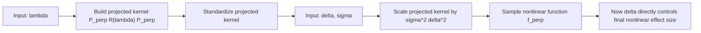

Median calibration:

- _Interpretively_, it disentangles "how nonlocal" (the order $d$) from "how large an effect I expect" (the median). Drop it and increasing $d$ simultaneously penalises small effects _and_ drags the prior mass outward — your BF across orders would conflate the two. That is not obviously a nuisance; it may be the thing that makes a comparison across $d$ meaningful.
- _Computationally_, dropping it buys you something real and specific to this trick: with $\kappa$ fixed, **one** base fit serves **all** orders, because every $\pi_d \propto \delta^d g_\kappa$ shares the same $g_\kappa$. You'd then get the entire family of moment-prior BFs from a single local fit plus analytic $C_d$ plus one set of posterior moments $\mathbb{E}^B[\delta^d\mid y]$.

So the trade-off is sharp: median calibration costs you the "one fit, all $d$" payoff. I'd resist deciding this on convenience alone — ask yourself what "comparable across $d$" is supposed to mean in the paper, and let that dictate whether the median anchor stays.

## The actual open problem: Monte Carlo variance, not algebra

This is where I'd focus your week. Since the identity is exact, the _only_ error is in estimating $\mathbb{E}^B_{\delta\mid y}[\delta^d]$ from draws (the denominator $C_d$ you already have in closed form via `C<i>d</i>half_t` — use it, don't re-estimate it from prior draws as the note's $\approx S^{-1}\sum(\tau^{(s)})^{2k}$ suggests; that just injects avoidable noise).

A reweighting estimator of a $d$-th moment has finite variance only if the $2d$-th moment is finite. Your base is half-$t$ with $\texttt{df}=6$, whose moments exist only up to order $<6$. So before running anything, reason about which $d$ can even work:

- $d=1$ needs $\mathbb{E}[\delta^2]<\infty$ — fine.
- $d=2$ needs $\mathbb{E}[\delta^4]<\infty$ — fine.
- $d=3$ needs $\mathbb{E}[\delta^6]<\infty$ — **at the boundary**, infinite if the posterior inherits the prior tail.

It's an importance-sampling diagnostic. Look at the effective sample size of the weights 
$\delta^d$ over your base-posterior draws (or a Pareto-$\hat k$ on the right tail), and benchmark the detour BF against `compute_bf_bridge` — your bridge sampler is the ground truth here — across a handful of datasets spanning weak-to-strong evidence and $d\in{1,2,3}$. If the detour and bridge agree where ESS is healthy and diverge precisely where the tail diagnostic flags trouble, you've both _explained_ and _bounded_ the method in one stroke.

## On extending to imoment priors

Algebraically, yes — and seeing why tells you why it's _harder_, not easier. The trick never needed $\delta^d$ specifically; for any alternative prior write $\pi^A(\delta)=w(\delta)\pi^B(\delta)$ and the same identity gives $BF^A_{10}=BF^B_{10}\cdot \mathbb{E}^B_{\delta\mid y}[w]/\mathbb{E}^B_\delta[w]$. For the inverse-moment prior $w(\delta)=\pi^I(\delta)/\pi^B(\delta)$ is no longer a tame polynomial: it vanishes _super-exponentially_ near zero and is _polynomially heavy_ in the tail. That is the worst possible shape for an importance weight — large exactly where your base posterior has little mass. So the imoment extension is exact on paper and considerably _more_ fragile in variance than the moment case, not less. There's also a conceptual opening here: for imoment there is no "natural" base at all, so $g$ becomes a free _proposal_ you may choose to tame the weights (a deliberately heavy-tailed $g$), which is a more honest framing of what the base prior is doing even in the moment case.

So, the question I'd actually have you answer before our next meeting: for your $\delta$ as it enters the Stan likelihood, do you expect the posterior upper tail to be lighter than half-$t(6)$, and at which $d$ does the moment-ratio estimator stop being trustworthy? Settle that, and you'll know whether this replaces your interval-null machinery or merely supplements it.

**你导师那张纸上写的不是一个具体的先验,而是一个"配方"。** 配方说的是——只要你的先验长成"$\delta^d$ 乘以某个 base,再除以常数"这个样子,BF 就能拆成 $BF^{\text{base}}$ 乘以那个矩比。这个配方对**任何** base 都成立,它根本不在乎你那个 base 是不是 median calibration 来的。

你导师的纸上没写 median calibration,不是因为他用了"另一个先验",而是因为他在写通用配方时没必要specify到那一步。J&R 不做 median calibration,只是他们那篇论文的选择,跟这个配方能不能用在你身上没关系。

你校准后的 moment prior 就是 $$\pi^M_d(\delta)=\frac{\delta^d g_{\kappa(d)}(\delta)}{C_d}$$

这里的 base,**就是** $g_{\kappa(d)}$——也就是你 median calibration 之后那个缩放过的 half-t。**你的 κ(d) 已经包在 base 里了。** 把这个 base 代进导师的配方,得到的 BF,和你 bridge sampling 跑的那个校准过的 nonlocal prior,是**字面上同一个先验**。所以它们当然能比,而且就该对得上。

唯一要做对的一件事(就这一件):做技巧法时,那次 base 拟合要用**和这个 d 配套的 `get_kappa(d)`**,不要用 1、也不要用别的 d 的 κ。Stan 里就是 `d_order = 0` 加上 `kappa_delta = get_kappa(d)`。这样它就正好是"你那个 d 阶校准先验,把 $\delta^d$ 摘掉之后剩下的东西"。κ 对上了,两边算的就是同一个先验。

一句话:**你不需要去迁就导师的任何 κ,你用你自己的就对了。** 你之前那个直觉("我的 κ 和导师的对不上")其实是个误会,根源是你以为导师锁定了一个先验,但他只是给了个公式。

- **路一(你现在的 bridge sampling):** 直接对那个 nonlocal prior 跑模型,用 bridge sampling 估边际似然,得到 BF。这条路慢、贵,但你信得过。
- **路二(导师的技巧):** 根本不碰 nonlocal prior,只跑 local base,做个 Savage-Dickey,再乘上那个矩比。这条路又快又省。

这两条路,目标是**同一个 BF**(因为先验本来就一样)。导师那张纸是一段**代数推导**,声称"路二 = 路一"。代数本身是对的,这点没问题。

那为什么还要比?因为路二里有一步是**蒙特卡洛估计**——那个矩比 $\mathbb{E}[\delta^d\mid y]$ 是用抽样的样本平均算出来的,不是精确值。代数告诉你"理论上两条路相等",但**没告诉你**:用有限个 MCMC 样本去估那个矩,误差到底有多大?会不会因为某些样本的尾巴抖得厉害,算出来飘?这正是你导师那句"I have not been able to verify whether it is actually working accurately enough"的意思——他不是怀疑公式错,是不确定**有限样本下数值准不准**。

所以这个比较检验的不是"先验对不对",而是:**这条又快又省的捷径,数值上到底可不可靠?** 你拿信得过的慢方法(bridge)当标尺,去验证那条快方法(技巧)算出来的数对不对得上。对得上 → 以后就可以扔掉 bridge,放心用快的;对不上 → 说明那个矩比的 MCMC 估计在你的场景里不稳,得想办法。

Q: 我首先有一个问题，我导师的这个方法，看起来是一个很general的推导出来的公式，之前有别的人用过吗？

**第一层:这个想法的"祖宗"很清楚。** 就是你项目里那篇 Johnson & Rossell (2010)。这篇论文的方法被实现在 R 包 mombf(Rossell)里,mombf 专门用来算 moment Bayes factor 和 inverse moment Bayes factor。后续还有一大串:Johnson & Rossell (2012) 把 nonlocal prior 推广到变量选择,提出 product moment(pMoM)和 product inverse moment(piMoM)先验,再到 Shin–Bhattacharya–Johnson、Fuquene–Steel–Rossell 等等。所以 moment-prior 的 BF 一点都不冷门,是一条成熟的线。

**第二层(关键区别,你要听清楚这层):** 这些已有工作算 moment-prior BF,绝大多数是在**共轭的线性模型**里做的——那里 BF 有闭式解或者只要算个低维积分,靠的是正态/g-prior 那套结构。换句话说,前人证明并用过的,是"在能闭式化的场景里,nonlocal BF 可以从 base 那套结构推出来"。而你导师写的那条路——**不靠共轭、直接拿 local base 的 MCMC 抽样,用 $\delta^d$ 重新加权,把矩比乘上去,在你这种非共轭的 GP 模型里恢复点零假设的 moment BF**——这个**具体的计算实现**,才是没有现成验证过的东西。

**第三层(这层能让你安心):** 那条路背后的"代数原理"本身又是非常老、非常标准的——就是"两个共享支撑的先验之间,可以通过重新加权来互换边际似然"。这其实就是 importance reweighting,也是 encompassing-prior / 广义 Savage–Dickey 的框架(Verdinelli & Wasserman 1996;Wetzels et al. 2010)——**这两篇你自己的 draft 里已经引用了**。所以从数学上讲,你导师的公式不是什么冒险的新主张,它是一个大家都懂的东西的干净特例。

在效应很大的时候,SDR 那一侧虽然不稳,但矩比 $\mathbb{E}^B[\delta^d\mid y]/\mathbb{E}^B[\delta^d]$ 那一侧反而很稳——后验集中在大 $\delta$ 处,$\delta^d$ 的均值很好估。而且这个比值本身会很大,直接把 BF 推向备择。所以两个部分是互补的:SDR 不稳的时候,正好是矩比很稳且 dominant 的时候。

你说得对,是我的问题。我用你导师的原始记号,只做 $\tau\to\delta$, $2k\to d$。

你导师的最后一行是:

$$BF^M_{10} = BF^B_{10}\cdot\frac{\mathbb{E}^B_{\delta\mid y}[\delta^d]}{\mathbb{E}^B[\delta^d]}$$

这个公式里 $\pi^B$ 同时扮演了**两个角色**:

- 角色 A:定义 $\pi^M$ 时里面的 base,即 $\pi^M=\delta^d,\pi^B,C^{-1}$
- 角色 B:你拿去拟合模型、做 SDR 的那个先验

你导师的推导之所以最后化简出 $\delta^d$,**恰恰是因为角色 A = 角色 B**,分子分母的 $\pi^B$ 约掉了。

但如果角色 B 用的是另一个先验——比如你拿 $d=0$ 的那个 $\pi^B_0 = g_{\kappa(0)}$ 来拟合——那推导完全一样,只是 $\pi^B$ 约不掉,最后一行变成:

$$BF^M_{10} = BF^{B_0}_{10}\cdot\mathbb{E}^{B_0}_{\delta\mid y}!\left[\frac{\pi^M(\delta)}{\pi^{B_0}(\delta)}\right]$$

这就是**唯一的区别**:

||角色 A = 角色 B|角色 A ≠ 角色 B|
|---|---|---|
|权重|$\delta^d / C$|$\pi^M(\delta);/;\pi^{B_0}(\delta)$|
|拟合几次|每个 $d$ 一次|所有 $d$ 共用一次|
|median calibration|保留|保留|

第二种情况的权重不再是简洁的 $\delta^d$,但 $\pi^M(\delta)$ 和 $\pi^{B_0}(\delta)$ 你都有解析表达式(`prior_moment_density` 和 `g_scaled`),每个抽样点上直接算数值就行。

这样清楚了吗?

我觉得应该看几个更higher- order的nonlocal prior，目前这几个差别不大

对，现在可以把话说得更直白一点：

- 不是 `n_eff` 问题
- 也不是 smoothing 技巧问题
- 就是 `[0,\varepsilon]` 里没质量

所以现在确实只剩两条路：

1. 继续用 `logspline` 这一类点/边界外推
2. 继续走 `interval-BF`，但要给 `\varepsilon` 一个能自圆其说的定义

我建议不要硬找“唯一正确的 `\varepsilon`”。更现实、也更好写进 paper 的做法是：

**给一个主分析的 `\varepsilon` 选择规则，再配 sensitivity analysis。**

最说得过去的规则，我觉得有两个。

**方案 A：practical significance calibration**
把 `\varepsilon` 定义成“多大的 nonlinear magnitude 还算 practically negligible”。

如果你的 `\delta` 可以解释成 nonlinear component 的幅度尺度，那就可以定义例如：

$$\varepsilon = c \cdot \sigma$$

或者更一般地：

$$
\varepsilon = c \times \text{(reference scale)}
$$

这里 `reference scale` 可以是：

- residual scale `\sigma`
- response 的标准差
- 在 simulation 里一个你认为“肉眼几乎看不出 nonlinear effect”的 level

优点：
- 最容易解释
- interval null 真正对应“practically null”

缺点：
- 你得先把 `\delta` 的实际意义说清楚
- `c` 还是要定

**方案 B：base-prior calibration**
既然你现在整个 reweighting 都是围绕 `d=0` base prior 展开的，那可以直接让 `\varepsilon` 由 base prior 来定：

$$P_{d=0}(\delta < \varepsilon) = \alpha$$

比如固定 `\alpha = 0.05` 或 `0.10`，然后解出 `\varepsilon`。

这等价于说：

- “我把 base prior 下最靠近 0 的 5%/10% 区域，定义为 practically null region”

优点：
- 完全先验决定，不看数据
- 和你现在的 base-prior / reweighting 框架高度一致
- 不会对不同 `d` 用不同的 null region

缺点：
- 解释上比 practical threshold 稍抽象
- `\alpha` 还是需要说明

**我更推荐你现在先走 B**
因为它最贴合你当前这条 methodological line，而且实现最直接：

- 先固定一个 base-prior null mass，比如 `10%`
- 用 `d=0` prior 解出对应 `\varepsilon`
- 这个 `\varepsilon` 对所有 `d` 都一样
- 然后再做 `\alpha = 0.05, 0.10, 0.20` 的 sensitivity

这样 paper 里可以写得很干净：

- primary analysis: `\varepsilon` is calibrated by the local base prior
- robustness: results are similar across several nearby calibrations

这比“拍脑袋设 `0.2`”强很多。

如果你愿意，我下一步可以直接在你的脚本里加一个函数，例如：

- `epsilon_from_base_prior_mass(alpha)`

然后给你算出 `alpha = 0.05, 0.10, 0.20` 分别对应的 `\varepsilon`。

能不能画一个图，但是考虑到linear的情况（和我的model一样），看nonlinear 怎么画 

**第二层：当前参数化不理想**

错的不是 orthogonalization，而是你现在让 delta 乘在**投影前 kernel**上。  
这样 delta 代表的是 raw GP scale，不是最终 nonlinear effect scale。
更好的做法是重新标定 kernel，让 delta 直接控制**投影后的典型振幅**。

projected RMS
RMS(f_perp) = sqrt(mean(f_perp^2))
- 先把 intercept 和 linear trend 去掉
- 再看剩下这个真正的 nonlinear part，典型振幅有多大

![[Pasted image 20260608105620.png]]

![[Pasted image 20260608105722.png]]

![[Pasted image 20260608110810.png]]![[Pasted image 20260608110801.png|544]]

$$BF^{M}_{10}

=

BF^{B}_{10}\cdot

E_{\,\delta\mid y}^{B}

\left[

\frac{\pi_M(\delta)}{\pi_{B}(\delta)}

\right],$$

Hi Joris,

The main reason my formulation differs from your handwritten derivation is that I again applied median calibration, so that each non-local prior has median = 2. This means that each prior order has its own calibrated base scale. Because of this, in my implementation the key identity remains in the more general form
$$p^{M}(y\mid M_1)
=
\int p(y\mid \delta)\pi^{M}(\delta)\,d\delta
=
p^{B}(y\mid M_1)\,
\mathbb{E}^{B}_{\delta\mid y}
\left[
\frac{\pi^{M}(\delta)}{\pi^{B}(\delta)}
\right].$$

In your derivation, all non-local priors are built from the same base prior, so the expression can be simplified further to

$$\mathbb{E}^{B}_{\delta\mid y}
\left[
\frac{\pi^{M}(\delta)}{\pi^{B}(\delta)}
\right]
=
\frac{\mathbb{E}^{B}_{\delta\mid y}[\delta^d]}{\mathbb{E}^{B}[\delta^d]}.$$

So yes, in my implementation it is no longer a ratio of expected values, but rather the expected value of the density ratio.

And yes, the second row is exactly the version where I use bridge sampling under the local/base prior and then reweight to obtain the BF for the non-local prior. The bridge-sampling check suggests that the reweighting step itself is working correctly.

At the moment, my impression is the following. 
- First, despite the extrapolation issue, logspline seems to be the most satisfactory option among the methods I have tried so far. Using an interval-null base BF instead of a point-null BF may alleviate the problem.
- Second, the current non-local prior family does seem to give some useful separation when the nonlinear effect is small, but the differences between prior orders are not very large overall. I have also thought about whether we should consider a more extreme non-local family, such as inverse-moment priors, but my concern is that this may make the near-null density problem even harder, since the prior would be even more strongly separated from the null point.

So perhaps one reasonable way to present this in the paper is to keep the current moment-prior family as the main non-local construction, and treat more extreme non-local priors as a possible exploratory/future extension rather than something we need to resolve immediately.

At the moment, my impression is the following. First, despite the extrapolation issue, logspline still seems to be the most satisfactory option among the methods I have tried so far. Using an interval-null base BF instead of a point-null BF may alleviate the problem to some extent, although it does not fully remove it. Second, the current non-local prior family does seem to give some useful separation when the nonlinear effect is small, but the differences between prior orders are not very large overall.

So I am t whether, in the paper, it may be better not to present the non-local prior as the main practical method, but rather as a theoretically motivated extension or sensitivity analysis. In that way, the main framework would still be the base/local-prior analysis, while the non-local prior would be used to examine how the conclusions change under stronger null-separating priors.

I also thought about whether we should consider a more extreme non-local family, such as inverse-moment priors, but my concern is that this might make the near-null density problem even harder rather than easier.

Best,
Harriet

我意思是：不要把 `non-local prior` 写成整篇 paper 的主要承重梁，而是把它写成“在主方法之上的一个 principled extension / robustness check”。

更具体一点，叙事上可以有两种层次。

**主线叙事**
你的 paper 主问题其实是：

- 怎样在 additive GP regression 里区分 linear effect 和 nonlinear effect
- 怎样用 Bayes factors 来做这件事

这条主线不一定需要 `non-local prior` 当唯一核心。  
你完全可以把主线写成：

1. 建立 additive GP regression framework
2. 用 BF 来检验 linear / nonlinear components
3. 讨论不同 prior constructions 对 BF 的影响
4. 其中 non-local prior 是一个有理论动机的 variant

也就是说，主角是：
- additive GP + BF for nonlinear effects

而不是：
- 我们发明了一个超强 non-local prior 方法，必须靠它整篇 paper 才成立

**secondary / sensitivity 的意思**
就是在结果展示和方法定位上，把 non-local prior 放在下面这个位置：

- main analysis: 用一个较稳、较容易解释的 baseline prior construction
- secondary analysis / sensitivity analysis: 检查 non-local prior family 是否带来系统性变化

这并不是“弱化贡献”，而是避免过度承诺。

---

### 在 paper 里怎么写会比较自然？

一种比较稳的叙事是：

**1. main methodological contribution**
- propose a Bayesian testing framework for linear vs nonlinear effects in additive GP regression
- derive BF-related computations
- discuss practical computation strategies

**2. prior section**
- start from a local/base prior as the computational anchor
- introduce non-local moment priors as a theoretically attractive extension
- explain that they are intended to sharpen evidence near the null

**3. computation section**
- explain reweighting
- show that reweighting works well when benchmarked against bridge sampling
- explain that some approximations remain challenging when posterior mass is far from the null

**4. results section**
- baseline results first
- then show how non-local priors modify the BF pattern
- interpret them as an additional perspective, not the single decisive result

这样读者会理解成：

- 这篇 paper 的核心是 testing framework
- non-local prior 是一个 thoughtfully developed extension
- 不是一切都必须建立在它数值上完美无缺

---

### 为什么这样更安全？

因为如果你把 `non-local prior` 放成 main claim，审稿人就会自然追问：

- 它到底比 baseline 好多少？
- 这个 improvement 是否明显？
- 数值上是否稳定？
- 如果 improvement 很小，为什么还需要它？

但如果你把它写成：

- “a theoretically motivated extension”
- “a robustness/sensitivity device”
- “a way to examine how stronger null-separation priors affect the BF”

那审稿人的预期就会不同。  
他会问的是：

- 这个 extension 是否 principled？
- 是否大致 consistent？
- 是否提供了额外 insight？

这个门槛比“它必须主导主分析结果”低很多，也更符合你现在手头的证据。

---

### 一个具体写法的感觉

比如你结果部分不是写：

- “Our proposed non-local prior method provides the main solution...”

而是写成：

- “We first report results under the baseline prior formulation. We then examine how the conclusions change under moment-based non-local priors, which provide a more stringent treatment of the null. This extension is computationally implemented through reweighting and serves to assess the robustness of the evidence to stronger null-separating priors.”

这就很自然地把它放在 second layer 了。

---

### 你这篇 paper 可能更适合的定位

基于你现在的进展，我觉得更自然的主线是：

- **main:** Bayesian assessment of linear and nonlinear effects in additive GP regression
- **extension:** non-local moment priors for strengthening null separation
- **computation note:** reweighting makes prior-order changes feasible without repeated fitting
- **limitation:** null-neighborhood approximation remains hard when posterior mass is far from the null

这个结构很完整，也很诚实。

如果你愿意，我下一步可以直接帮你写一个更具体的“paper storyline outline”，按
- Introduction
- Method
- Prior section
- Computation
- Results
- Discussion
这样给你列出来。