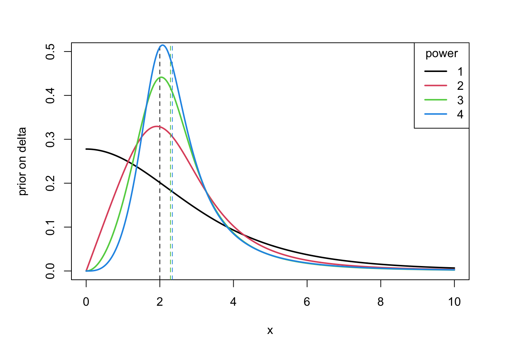
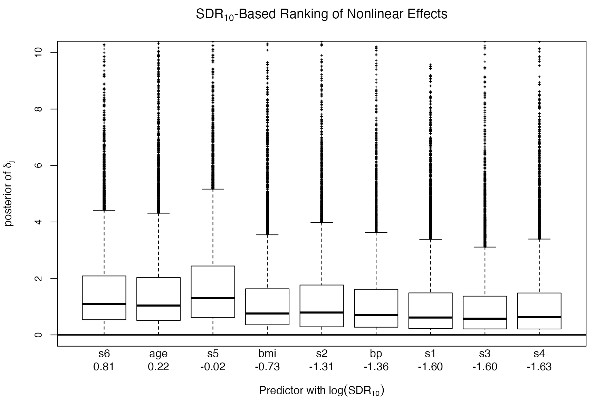
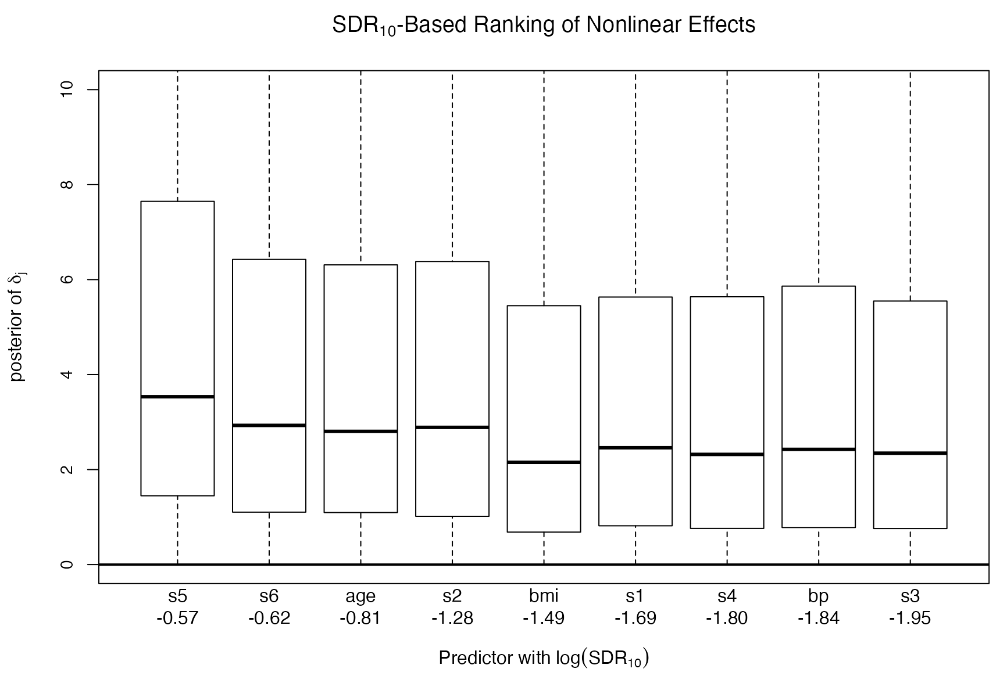

## Progress This Week

- Higher order non-local priors for $\delta$.
- Empirical p2 application 
- GAM diagnostics

# 1. Non-local Priors

## Candidate priors p1–p4

```{=html}
<style>
table {
  font-size: 0.5em;
}
</style>
```
| | $\delta \sim t^+(df=4,s=2.7)$ | $\delta^2 \sim t^+(df=1.5,s=6)$ | $\delta^3 \sim t^+(df=1,s=12)$ | $\delta^4 \sim t^+(df=0.7,s=25)$ | 
| --- | --- | --- | --- | --- | 
| Q50 | 1.9999 | 2.2881 (14.41%) | 2.2894 (14.48%) | 2.3405 (17.03%) | 
| Q90 | 5.7560 | 4.7150 (18.09%) | 4.2315 (26.49%) | 4.2931 (25.42%) | 
| Q99 | 12.4311 | 10.3403 (16.82%) | 9.1413 (26.46%) | 9.7732 (21.38%) | 
| Tail | -5.000 | -4.000 | -4.000 | -3.800 |

* *Tail*: how slowly the prior probability decays as $\delta \to \infty$

{fig-align="center" width=100%"}

## Simulation: Dataset 1 (small nonlinear effect)
```
N = 50, range(x) = 1, delta=0.5, lambda=0.3, sigma=0.1, 10th
```

:::{.cell}
| **Prior** | **prior at 0** | **post at 0** | **SDR** | **Median delta** | **Median lambda** |
| --- | --- | --- | --- | --- | --- |
| p1 | 0.2777778 | 0.347 | 0.8 | 1.003251 | 0.353345 |
| p2 | 0.1135783 | 0.194 | 0.58 | 1.619352 | 0.3992331 |
| p3 | 0.05305165 | 0.148 | 0.36 | 1.863093 | 0.4230877 |
| p4 | 0.0235709 | 0.070 | 0.33 | 2.014852 | 0.4348687 |
:::

- When effect is weak, SDR behaves as expected. 

## Simulation: Dataset 2 (large nonlinear effect)

```
N = 50, range(x) = 1, delta=3, lambda=0.3, sigma=0.1, 1st
```

| Prior | SDR | Median delta | Median lambda |
| --- | --- | --- | --- |
| p1 | 7.56e+02 | 2.31 | 0.41 |
| p2 | 60.81 | 2.28 | 0.40 |
| p3 | 4.19566 | 2.250076 | 0.40 |
| p4 | 0 | 2.28 | 0.41 |

- Strong nonlinearity makes SDR highly sensitive to estimating posterior density at 0.

## Simulation: Dataset 2 (large nonlinear effect)

### Trim posterior to use the first 90%, 80%, 70%, or 60% of samples 

|  | **prior at 0** | **post at 0 (SDR10)** | **0.9** | **0.8** | **0.7** | **0.6** |
| --- | --- | --- | --- | --- | --- | --- |
| p1 | 0.2777778 | 0.000367 (756.3239) | 0.000389 (714.6245) | 0.000793 (350.2573) | 0.001092 (254.2482) | 0.000638 (435.6454) |
| p2 | 0.1135783 | 0.0019 (60.81384) | 0.0031 (37.0008) | 0.0049 (23.01086) | 0.0037 (30.41612) | 0.0085 (13.37891) |
| p3 | 0.05305165 | 0.01264 (4.19566) | 0.0027 (19.80992) | 0.0029 (18.40702) | 0.0050 (10.55508) |  0.0039 (13.70944) |
| p4 | 0.0235709 | Inf (0) | 0.0027 (8.628321) | 0.0032 (7.405106) | 0.0141 (1.673175) | 0.0163 (1.445878) |

- Trimming reduces tail influence and stabilizes post-at-0, but doesn't fully offset changes in prior-at-0.

# 2. Empirical p2 application 

## Empirical: Diabetes — SDR results


::: {.columns}
::: {.column width="50%"}
**Nonlinear SDR (p1 vs p2)**
```
         p1      p2
age      1.56    0.445
bmi      0.54    0.225
bp       0.29    0.159
s1       0.21    0.184
s2       0.33    0.277
s3       0.18    0.142
s4       0.21    0.165
s5       1.14    0.567
s6       2.29    0.538
```
:::
::: {.column width="50%"}
**Linear SDR (p1 vs p2)**
```
         p1        p2
age      4.33e-02  4.25e-02
bmi      4.40e+06  9.00e+06
bp       8.67e+01  1.48e+02
s1       1.36e+00  1.34e+00
s2       9.93e-01  1.01e+00
s3       3.73e-01  4.04e-01
s4       1.58e-01  1.67e-01
s5       1.73e+00  1.51e+00
s6       6.62e-02  6.58e-02
```
:::
:::

- p2 nonlinear SDRs are smaller than p1 for most predictors. 
- Several predictors show a different direction of evidence.
- the p1–p2 discrepancy is not from MCMC mixing (posteriors look stable), but from SDR density-at-zero estimation being harder for $\delta^2$ (heavier tail / fewer samples near 0).

## Empirical: Diabetes — Check Posterior

::: {.columns}
::: {.column width="50%"}
**Posterior: p1 — delta**
{fig-align="center" width="90%"}
:::
::: {.column width="50%"}
**Posterior: p2 — delta^2**
{fig-align="center" width="90%"}
:::
:::


## Empirical: Boston — SDR results


::: {.columns}
::: {.column width="50%"}
**Nonlinear SDR (p1 vs p2)**
```
         p1         p2
crim     3.15e+01   1.56e+01
zn       2.75e-01   4.93e-01
indus    8.58e+01   7.59e+00
nox      1.14e+05   8.63e+02
rm       3.54e+04   2.74e+02
age      1.51e-01   2.62e-01
dis      9.24e+03   1.15e+03
tax      1.17e+04   6.45e+02
ptratio  2.31e-01   3.85e-01
black    5.05e-01   7.15e-01
lstat    2.85e+03   1.24e+03
```
:::
::: {.column width="50%"}
**Linear SDR (p1 vs p2)**
```
         p1          p2
crim     1.73e+02    1.11e+02
zn       1.93e-01    2.02e-01
indus    3.36e-01    3.29e-01
nox      6.85e-01    7.70e-01
rm       2.52e+10    1.61e+10
age      1.11e-01    1.14e-01
dis      1.07e+02    8.09e+01
tax      7.44e-01    7.82e-01
ptratio  5.02e+05    1.74e+04
black    1.30e-01    1.30e-01
lstat    1.80e+12    3.97e+11
```
:::
:::


# 3. GAM

## GAM Fits

### Linear-only DGP: Type I Error on Smooth Term

**Design**: $y = \beta x + \epsilon$, $n=50$, 1000 replicates, $\beta=0.5$

| **Method** | **Type I Error (p < 0.05)** |
| --- | --- |
| `mgcv::gam(y ~ x + s(x))` | **<span style="color:red;">0.620</span>** |
| `gam::gam(y ~ x + s(x))` | **0.064** |
| `mgcv::gam(y ~ x + s(x, bs="tp", m=1, k=10))` | **0.080** |

<br>

- Unconstrained smooth in mgcv severely inflates false positives (62%)
- First-derivative penalty (`m=1`) reduces inflation to near-nominal (8%)
- `gam::gam` maintains nominal rate but uses different fitting approach

## GAM Fits

### Nonlinear-only DGP

**Design**: $y = \sin(2x) + \epsilon$, $n=50$, many replicates

|  | **Type I Error (Linear)** | **Power (Nonlinear)** |
| --- | --- | --- |
| `mgcv` with `m=1` | 0.003 | 0.947 |
| `gam::gam` | <span style="color:red;">0.202</span> | 0.976 |

<br>

- `mgcv` with `m=1`: conservative on linear effects, high power for nonlinearity
- `gam::gam`: tends to over-call linear effects

## GAM Fits: Real Data Analysis

### Bootstrap p-value rates (Diabetes dataset)

Bootstrap procedure: 100 resamples, proportion of significant tests (p < 0.05) reported for each predictor.

::: {.columns}
::: {.column width="50%"}
**mgcv::gam** (`m=1`)
```
         linear  nonlinear
age       0.03      0.82
bmi       0.43      0.83
bp        0.51      0.48
s1        0.17      0.29
s2        0.06      0.69
s3        0.02      0.23
s4        0.05      0.84
s5        0.68      0.33
s6        0.00      0.80
```
:::
::: {.column width="50%"}
**gam::gam**
```
         linear  nonlinear
age       1.00      0.85
bmi       1.00      0.79
bp        1.00      0.35
s1        0.39      0.37
s2        0.45      0.65
s3        1.00      0.14
s4        0.33      0.23
s5        1.00      0.32
s6        0.19      0.93
```
:::
:::

## GAM Fits: Real Data Analysis (cont.)

### Bootstrap p-value rates (Boston Housing dataset)

::: {.columns}
::: {.column width="50%"}
**mgcv::gam** (`m=1`)
```
          linear  nonlinear
crim       0.41      0.62
zn         0.23      0.52
indus      0.08      0.51
nox        0.14      0.00
rm         0.71      0.00
age        0.15      0.50
dis        0.88      0.17
tax        0.37      0.10
ptratio    0.45      0.49
black      0.02      0.75
lstat      0.71      0.18
```
:::
::: {.column width="50%"}
**gam::gam**
```
          linear  nonlinear
crim       1.00      0.90
zn         1.00      0.49
indus      1.00      0.95
nox        0.91      0.97
rm         1.00      0.05
age        0.90      0.30
dis        1.00      0.88
tax        0.44      0.85
ptratio    1.00      0.18
black      0.99      0.96
lstat      1.00      0.63
```
:::
:::

**Systematic pattern**: `gam` produces higher linear significance rates across predictors compared to constrained `mgcv`

